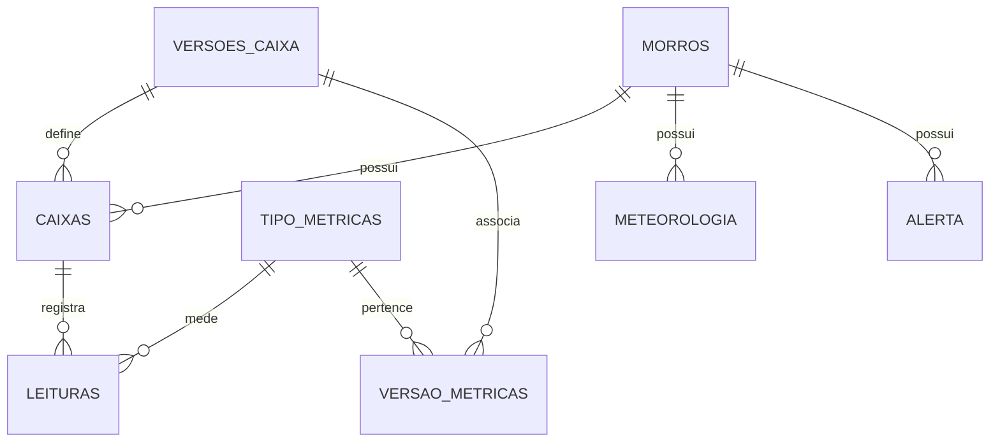

# FIAP - Faculdade de Informática e Administração Paulista

<p align="center">
<a href= "https://www.fiap.com.br/"></a>
</p>

<br>

# Vigia Morro

### Integrantes:
- <a href="https://www.linkedin.com/in/caiooliveiraeti">Caio Oliveira</a>

## 👩‍🏫 Professores:
### Tutor(a) 
- <a href="https://www.linkedin.com/in/lucas-gomes-moreira-15a8452a/">Lucas Gomes</a>
### Coordenador(a)
- <a href="https://www.linkedin.com/in/andregodoichiovato/">Andre Godoi</a>

O **Vigia Morro** é um sistema de linha de comando voltado para a Defesa Civil, com foco no monitoramento de áreas de risco e prevenção de desastres. Ele permite o gerenciamento de morros, sensores e medições, além de importar e exportar dados em formato CSV ou JSON.

## Impacto na Defesa Civil

O monitoramento de variáveis ambientais é essencial para a gestão de áreas de risco e a prevenção de desastres naturais, como deslizamentos de terra e enchentes. O **Vigia Morro** oferece uma solução prática para gerenciar sensores que coletam dados como:

- **Umidade do Solo**: Ajuda a identificar condições de saturação do solo, prevenindo deslizamentos.
- **Temperatura**: Permite monitorar variações climáticas que podem indicar mudanças perigosas.
- **Alertas**: Integra sensores de alerta para situações críticas, como chuvas intensas.

Com esses dados, equipes de Defesa Civil podem tomar decisões rápidas e informadas para proteger vidas e minimizar danos.

## Funcionalidades

- **Gerenciamento de Morros**: Adicionar, listar e remover morros monitorados.
- **Gerenciamento de Caixas**: Adicionar, listar e remover caixas vinculadas a morros.
- **Conexão de Sensores**: Conectar caixas para registrar leituras em tempo real.
- **Conexão de Alertas**: Conectar caixas para acionar os alertas.
- **Registro de Leituras**: Cadastrar medições para caixas.
- **Importação de Leituras**: Importar medições de caixas a partir de arquivos CSV.
- **Exportação de Leituras**: Exportar todas as medições de um morro para arquivos CSV ou JSON.
- **Crawler de Meteorologia**: Consulta dados meteorológicos em tempo real e os armazena no banco de dados.
- **Previsão de Deslizamentos**: Utiliza aprendizado de máquina para prever riscos de deslizamentos com base em dados históricos.

## Simulador de Caixas

O projeto inclui simuladores de caixas desenvolvidos no Wokwi para testar a integração com o sistema. Os simuladores utilizam ESP32 para simular sensores de umidade, temperatura e alertas.

- **SensorBox**: Simula sensores de umidade e temperatura do solo.
- **AlertBox**: Simula o acionamento de alertas sonoros.

Para mais detalhes, consulte os [READMEs dos simuladores](simulators/sensorbox/README.md) e [AlertBox](simulators/alertbox/README.md).

## Exemplos de Uso Prático

1. **Monitoramento de Áreas de Risco**:
   - Sensores de umidade e temperatura são instalados em diferentes morros.
   - As leituras são registradas no sistema e analisadas para identificar condições de risco, como deslizamentos de terra.
   - Isso melhora a segurança e permite ações preventivas.

2. **Gestão de Emergências**:
   - Sensores de alerta enviam notificações em situações críticas, como chuvas intensas.
   - Isso permite respostas rápidas para evacuar áreas e minimizar danos.

3. **Planejamento Preventivo**:
   - Dados históricos de sensores ajudam a identificar padrões e planejar ações preventivas, como reforço de encostas e drenagem.

4. **Previsão de Deslizamentos**:
   - O sistema utiliza um modelo de aprendizado de máquina para prever riscos de deslizamentos com base em variáveis como umidade do solo, temperatura e condições meteorológicas.

## Requisitos para executar o código

- Python 3.8 ou superior
- Banco de dados Oracle (configurado via `docker-compose.yml`)

## 🔧 Como executar o código

1. Clone o repositório:
   ```bash
   git clone https://github.com/caiooliveiraeti/vigia-morro.git
   ```

2. Inicie o banco de dados Oracle com Docker:
   ```bash
   docker-compose up -d
   ```

3. Execute o sistema:
   ```bash
   make
   ```

## Uso

Ao executar o sistema, você verá um menu interativo com as seguintes opções:

Siga as instruções no terminal para realizar as operações desejadas.

## Estrutura do Projeto

- **`src/vigia_morro/core/services`**: Contém a lógica de negócios para morros, caixas, meteorologia e previsão.
- **`src/vigia_morro/core/repositories`**: Implementa a comunicação com o banco de dados Oracle.
- **`src/vigia_morro/cli.py`**: Implementa a interface de linha de comando.
- **`scripts/database/*`**: Scripts para criar e popular as tabelas no banco de dados.
- **`simulators/sensorbox`**: Contém o simulador de caixas de coleta de dados desenvolvido no Wokwi.
- **`simulators/alertbox`**: Contém o simulador de caixas de alertas desenvolvido no Wokwi.

# Modelo Entidade-Relacionamento (DER)

O banco de dados do **Vigia Morro** foi projetado para gerenciar morros, caixas, leituras e suas associações. Abaixo está o DER atualizado que representa a estrutura do banco de dados:

