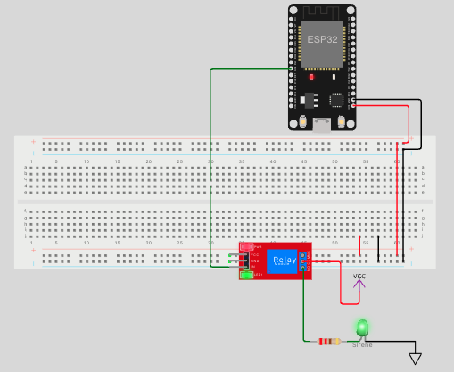

# AlertBox: Sistema de Alerta Simulado

O **AlertBox** é um sistema embarcado simulado para ativação e desativação de alertas sonoros, representados por um relé controlando uma sirene. Ele permite a interação via comandos seriais, sendo ideal para testes e integração com sistemas externos.

## Simulação no Wokwi e Interpretação dos Dados Seriais

### Prefixos das mensagens seriais

- `LOG:` — Mensagens de **log, status e avisos** do sistema embarcado.
  - Exemplo:  
    `LOG:[INFO] Alerta ATIVO.`  
    `LOG:[INFO] Alerta DESLIGADO.`  
    `LOG:Sistema de alerta iniciado!`

### Como funciona no Simulador

- **Relé:** GPIO26 — Representa a sirene de alerta (ligada/desligada).



> Sempre monitore o **Serial Monitor** no Wokwi para acompanhar o funcionamento do sistema, distinguir logs e depurar/testar sua integração.

---

### Modo de Decisão Externa

No modo de decisão externa, o sistema aguarda comandos via Serial para ativar ou desativar o alerta. Para usar este modo:

1. **Conecte-se à Serial com `pyserial`:**
   - Instale o `pyserial` se ainda não tiver:  
     ```bash
     pip install pyserial
     ```
   - Conecte-se à porta serial do ESP32 usando `rfc2217`:  
     ```python
     import serial
     ser = serial.serial_for_url('rfc2217://localhost:4401', baudrate=115200)
     ```

2. **Envie comandos para controlar o alerta:**
   - Para **ativar** o alerta, envie o caractere `1`:  
     ```python
     ser.write(b'1')
     ```
   - Para **desativar** o alerta, envie o caractere `0`:  
     ```python
     ser.write(b'0')
     ```

3. **Monitore os logs no Serial Monitor:**
   - Exemplo de log ao ativar o alerta:  
     `LOG:[INFO] Alerta ATIVO.`  
   - Exemplo de log ao desativar o alerta:  
     `LOG:[INFO] Alerta DESLIGADO.`

---

### Como executar no VS Code usando Wokwi e PlatformIO

1. **Instale as extensões necessárias**:
   - Certifique-se de que as extensões `PlatformIO IDE` e `Wokwi` estão instaladas no VS Code.  
     Você pode instalá-las diretamente na aba de extensões do VS Code.

2. **Abra o projeto no VS Code**:
   - Navegue até o diretório do simulador:
     ```bash
     cd simulators/alertbox
     ```
   - Abra o diretório no VS Code:
     ```bash
     code .
     ```

3. **Compile e carregue o firmware**:
   - Na barra lateral do PlatformIO, clique em **Build** para compilar o código.

4. **Inicie o simulador no Wokwi**:
   - Clique no arquivo `diagram.json` e selecione **Start Wokwi Simulator**.
   - O Wokwi iniciará no simulador com o circuito.

5. **Teste o simulador**:
   - Use os comandos via Serial para ativar/desativar o alerta.
   - Monitore os logs enviados pelo simulador no monitor serial.
