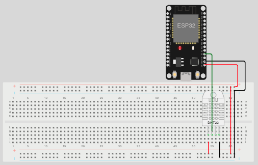

# SensorBox: Sistema de Monitoramento Simulado

O **SensorBox** é um sistema embarcado simulado para monitoramento de umidade e temperatura do solo, utilizando sensores como o DHT22. Ele permite a interação via comandos seriais, sendo ideal para testes e integração com sistemas externos, como scripts Python ou bancos de dados.

## Simulação no Wokwi e Interpretação dos Dados Seriais

### Prefixos das mensagens seriais

- `DATA:` — Linha de **dados dos sensores** enviados para integração com o sistema externo (Python, banco de dados etc).
  - Exemplo:  
    `DATA:MID=550e8400-e29b-41d4-a716-446655440000,CID=CAIXA001,H=52.50,T=25.30`
    - Identificador único do módulo (`MID`), identificador da caixa (`CID`), umidade do solo (`H`), temperatura do solo (`T`).
  - **Formato detalhado**:
    - `MID`: Identificador único do módulo (UUID).
    - `CID`: Identificador da caixa (string).
    - `H`: Umidade do solo em porcentagem.
    - `T`: Temperatura do solo em graus Celsius.
- `LOG:` — Mensagens de **log, status, avisos e modo de decisão** do sistema embarcado.
  - Exemplo:  
    `LOG:[INFO] Irrigacao ATIVA (decisao EXTERNA).`
  - **Tipos de mensagens**:
    - `[INFO]`: Informações gerais do sistema.
    - `[ERRO]`: Mensagens de erro ou falhas.

### Como funciona no Simulador

- **DHT22:** GPIO2 — Mede umidade e temperatura do solo (simulada).



> Sempre monitore o **Serial Monitor** no Wokwi para acompanhar o funcionamento do sistema, distinguir logs e leituras de dados, e depurar/testar sua integração Python.

---

### Modo de Decisão Externa

No modo de decisão externa, o sistema aguarda comandos via Serial para ativar ou desativar a irrigação. Para usar este modo:

1. **Configure o sistema para o modo externo:**
   - Certifique-se de que o firmware está configurado para enviar dados via Serial.

2. **Conecte-se à Serial com `pyserial`:**
   - Instale o `pyserial` se ainda não tiver:  
     ```bash
     pip install pyserial
     ```
   - Conecte-se à porta serial do ESP32 usando `rfc2217`:  
     ```python
     import serial
     ser = serial.serial_for_url('rfc2217://localhost:4400', baudrate=115200)
     ```

3. **Monitore os dados enviados pelo sistema:**
   - Exemplo de dados enviados:  
     `DATA:MID=550e8400-e29b-41d4-a716-446655440000,CID=CAIXA001,H=52.50,T=25.30`

---

### Como executar no VS Code usando Wokwi e PlatformIO

1. **Instale as extensões necessárias**:
   - Certifique-se de que as extensões `PlatformIO IDE` e `Wokwi` estão instaladas no VS Code.  
     Você pode instalá-las diretamente na aba de extensões do VS Code.

2. **Abra o projeto no VS Code**:
   - Navegue até o diretório do simulador:
     ```bash
     cd simulators/sensorbox
     ```
   - Abra o diretório no VS Code:
     ```bash
     code .
     ```

3. **Compile e carregue o firmware**:
   - Na barra lateral do PlatformIO, clique em **Build** para compilar o código.

4. **Inicie o simulador no Wokwi**:
   - Clique no arquivo `diagram.json` e selecione **Start Wokwi Simulator**.
   - O Wokwi iniciará no simulador com o circuito.

5. **Teste o simulador**:
   - Monitore os dados enviados pelo simulador no monitor serial.
